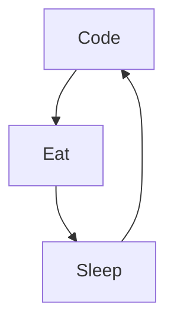

### Hi there 👋

<!--
**JohnAOSC/JohnAOSC** is a ✨ _special_ ✨ repository because its `README.md` (this file) appears on your GitHub profile.

Here are some ideas to get you started:

- 🔭 I’m currently working on ...
- 🌱 I’m currently learning ...
- 👯 I’m looking to collaborate on ...
- 🤔 I’m looking for help with ...
- 💬 Ask me about ...
- 📫 How to reach me: ...
- 😄 Pronouns: ...
- ⚡ Fun fact: ...

### 🔥 Recent GitHub Activity

<!--START_SECTION:activity-->
1. 
2. 
3. 
4. 
5. 
<!--END_SECTION:activity-->

